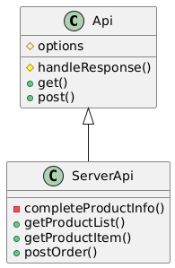
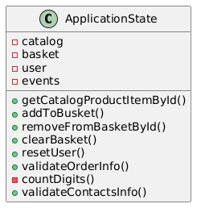
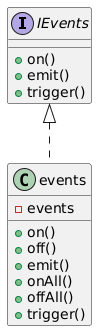
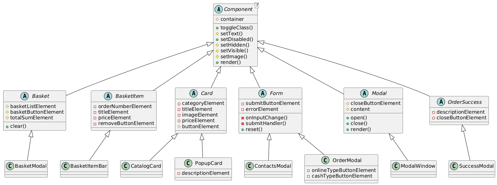

# Проектная работа "Веб-ларек"

Стек: HTML, SCSS, TS, Webpack

Структура проекта:
- src/ — исходные файлы проекта
- src/components/ — папка с JS компонентами

Важные файлы:
- src/pages/index.html — HTML-файл главной страницы
- src/types/index.ts — файл с типами
- src/index.ts — точка входа приложения
- src/scss/styles.scss — корневой файл стилей
- src/utils/constants.ts — файл с константами
- src/utils/utils.ts — файл с утилитами

## Установка и запуск
Для установки и запуска проекта необходимо выполнить команды

```
npm install
npm run start
```

или

```
yarn
yarn start
```
## Сборка

```
npm run build
```

или

```
yarn build
```

## Архитектура приложения

В качестве архитектурного паттерна был выбран MVP (Model-View-Presenter).
Проект будет разбит на три модуля: Model - реализация логики работы сайта, View - представление данных пользователю и Presenter - брокер событий, связывающий логику с представлением.

### Модель

Для определения компонентов модели сначала нужно описать данные, которые используются в процессе работы приложения.

Основным объектом является товар. Опишем его свойства:

**Товар**:

* идентификатор
* подробное описание
* ссылка на изображение
* заголовок
* категория
* цена товара

Товары нужны для хранения в двух контейнерах: в **каталоге** и в **корзине**

В процессе оформления заказа также будет накапливаться информация о пользователе. По итогу, можно представить объект со следующими свойствами: 

**Пользователь**:

* адрес
* почта
* телефон
* тип оплаты

### Представление

Как следует из дизайна, пользователь взаимодействует с несколькими окнами. Опишем их подробнее:

**Главное окно каталога**:

* содержит карточки товаров
* содержит изображение-ссылку на корзину

**Попап карточки**:

* содержит информацию о карточке
* кнопка 'В корзину'
* кнопка закрытия попапа

**Модальное окно корзины**:

* содержит список выбранных товаров
* позволяет удалять товары
* кнопка 'Оформить'
* кнопка закрытия модального окна

**Модальное окно**:

* выбор способа оплаты
* ввод адреса доставки
* кнопка 'Далее'
* кнопка закрытия модального окна

**Модальное окно контактной информации**:

* ввод почты
* ввод телефона
* кнопка 'Оплатить'
* кнопка закрытия модального окна

**Модальное окно размещения заказа**

* кнопка выхода из модального окна 'За новыми покупками!'
* кнопка закрытия модального окна


### Брокер событий

Брокер событий реализует принцип выдачи сигнала слушателям при наступлении определенного события.

Например, нажатие на кнопку "В корзину" в попапе товара вызывает событие добавления товара в корзину.

## Описание типов

Опишем типы, соответствующие спроектированной архитектуре.

### API

В этом пункте опишем данные, которые используются при взаимодействии с сервером.

При GET-запросах данные с сервера приходят в следующем виде:

`Product Item`:

```ts
ProductItem = {
    id: string,
    description: string,
    image: string,
    title: string
    category: Category,
    price: number | null
}

, где

Category = 'софт-скил' 
            | 'другое' 
            | 'дополнительное' 
            | 'кнопка' 
            | 'хард-скил';
```
`Product List`:

```ts
ProductList = {
    total: number,
    items: ProductItem[]
}
```

Для размещения заказа через метод POST используется объект `Order`:

```ts
Order = {
    id: string,
    total: number
}
```

### Presenter

Перенесем из events.ts уже написанные типы для обеспечения связей сигнал-обработчик.

Определим тип имени события: 

```ts
EventName = string | RegExp;
```

Подписчик на событие (обработчик):


```ts
Subscriber = Function;
```

Тип для описания случившегося события:

```ts
EmitterEvent = {
    eventName: EventName,
    data: unknown
};
```

Наконец, опишем контракт, который предоставляет основной элемент Presenter:

```ts
interface IEvents {
    on<T extends object>(event: EventName, callback: (data: T) => void): void;
    emit<T extends object>(event: string, data?: T): void;
    trigger<T extends object>(event: string, context?: Partial<T>): (data: T) => void;
}
```

### View

Опишем основные типы, необходимые для структуризации отображения логики приложения.

В приложении имеются следующие компоненты: Карточка (Card), Форма (Form), Модальное окно (Modal), Окно успешного оформления заказа (Success), Корзина (Basket), Элемент корзины (BasketItem). Для удобной реализации каждого из компонентов необходимо описать их особенные свойства и набор поддерживаемых методов для работы с ними. Свойства будем оформлять в виде объектных типов, а методы в виде интерфейсов-контрактов.

Типы для компонента корзины:

```ts
export type BasketInfo = {
    totalSum: string | number,
    isDisabled: boolean
    items: HTMLElement[],
};

export interface IBasket {
    onBuy(): void;
}
```

Типы для элемента корзины:

```ts
export type BasketItemInfo = {
    title: string,
    price: string | number | null,
    index: number | string
};

export interface IBasketItem {
    onRemove(): void;
};

export type BasketItemBarInfo = {
    id: string
} & BasketItemInfo;
```

Типы для карточки:

```ts
export type CardInfo = {
    category: Category,
    title: string
    image: string,
    price: number | null
}

export interface ICard {
    onClick(): void;
}
```

Типы для формы:

```ts
export type FormInfo = {
    isValid: boolean;
    errorList: string[];
}

export interface IForm<T> {
    onSubmit(): void;
    onInput(field: keyof T, value: string, message: string): void;
};
```

Типы для модальных окон:

```ts
export type ModalInfo = {
    content: HTMLElement;
}

export interface IModal {
    onOpen(): void;
    onClose(): void;
}
```

Типы для окна успешного оформления:

```ts
export type SuccessInfo = {
    totalSum: number;
}

export interface ISuccess {
    onClick(): void;
};
```

Типы для карточки в попапе и в каталоге:

```ts
export type PopupCardInfo = {
    id: string,
    description: string,
    isDisabled: boolean
} & CardInfo;

export type CatalogCardInfo = {
    id: string
} & CardInfo;
```

Типы для модальных окон с информацией о заказе и контактной информацией:

```ts
export type ContactsInfo = {
    email: string,
    phone: string
}

export type OrderInfo = {
    payment: string,
    address: string
}
```

### Model

Модель будет описывать хранение и обработку имеющихся на сайте данных. В нашем случае основные данные - товары и информация о пользователе. Данные уже описаны в разделе API. Осталось описать пользователя:

```ts
export type UserInfo = OrderInfo & ContactsInfo;
```


## Реализация

Представим реализацию наглядно, в виде UML-диаграммы классов для каждого из модулей архитектуры.

### UML-диаграммы классов

API:



Model:



Presenter:



View:

