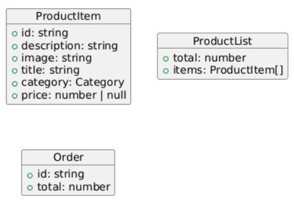
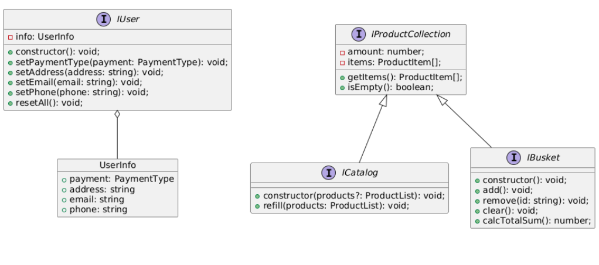
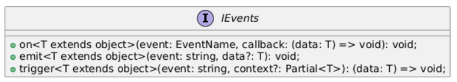
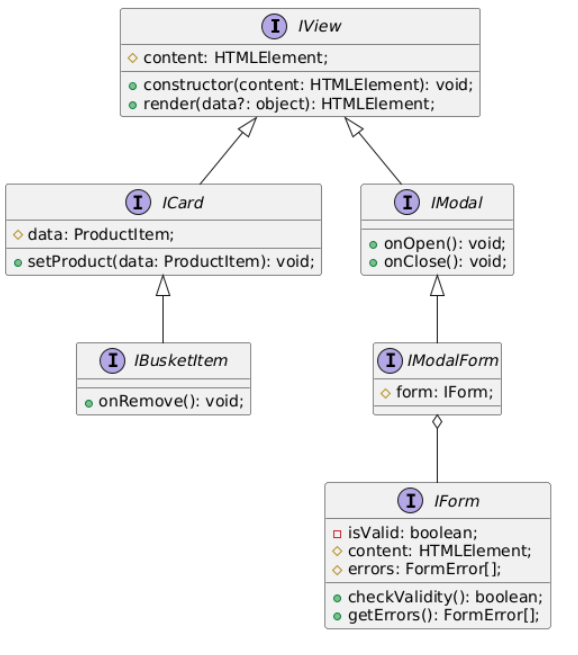

# Проектная работа "Веб-ларек"

Стек: HTML, SCSS, TS, Webpack

Структура проекта:
- src/ — исходные файлы проекта
- src/components/ — папка с JS компонентами
- src/components/base/ — папка с базовым кодом

Важные файлы:
- src/pages/index.html — HTML-файл главной страницы
- src/types/index.ts — файл с типами
- src/index.ts — точка входа приложения
- src/scss/styles.scss — корневой файл стилей
- src/utils/constants.ts — файл с константами
- src/utils/utils.ts — файл с утилитами

## Установка и запуск
Для установки и запуска проекта необходимо выполнить команды

```
npm install
npm run start
```

или

```
yarn
yarn start
```
## Сборка

```
npm run build
```

или

```
yarn build
```

## Архитектура приложения

В качестве архитектурного паттерна был выбран MVP (Model-View-Presenter).
Проект будет разбит на три модуля: Model - реализация логики работы сайта, View - представление данных пользователю и Presenter - брокер событий, связывающий логику с представлением.

### Модель

Для определения компонентов модели сначала нужно описать данные, которые используются в процессе работы приложения.

Основным объектом является товар. Опишем его свойства:

**Товар**:

* идентификатор
* подробное описание
* ссылка на изображение
* заголовок
* категория
* цена товара

Товары нужны для хранения в двух контейнерах: в **каталоге** и в **корзине**

В процессе оформления заказа также будет накапливаться информация о пользователе. По итогу, можно представить объект со следующими свойствами: 

**Пользователь**:

* адрес
* почта
* телефон
* тип оплаты

### Представление

Как следует из дизайна, пользователь взаимодействует с несколькими окнами. Опишем их подробнее:

**Главное окно каталога**:

* содержит карточки товаров
* содержит изображение-ссылку на корзину

**Попап карточки**:

* содержит информацию о карточке
* кнопка 'В корзину'
* кнопка закрытия попапа

**Модальное окно корзины**:

* содержит список выбранных товаров
* позволяет удалять товары
* кнопка 'Оформить'
* кнопка закрытия модального окна

**Модальное окно**:

* выбор способа оплаты
* ввод адреса доставки
* кнопка 'Далее'
* кнопка закрытия модального окна

**Модальное окно контактной информации**:

* ввод почты
* ввод телефона
* кнопка 'Оплатить'
* кнопка закрытия модального окна

**Модальное окно размещения заказа**

* кнопка выхода из модального окна 'За новыми покупками!'
* кнопка закрытия модального окна


### Брокер событий

Брокер событий реализует принцип выдачи сигнала слушателям при наступлении определенного события.

Например, нажатие на кнопку "В корзину" в попапе товара вызывает событие добавления товара в корзину.

## Описание типов

Опишем типы, соответствующие спроектированной архитектуре.

### API

В этом пункте опишем данные, которые используются при взаимодействии с сервером.

При GET-запросах данные с сервера приходят в следующем виде:

`Product Item`:

```ts
ProductItem = {
    id: string,
    description: string,
    image: string,
    title: string
    category: Category,
    price: number | null
}

, где

Category = 'софт-скил' 
            | 'другое' 
            | 'дополнительное' 
            | 'кнопка' 
            | 'хард-скил';
```
`Product List`:

```ts
ProductList = {
    total: number,
    items: ProductItem[]
}
```

Для размещения заказа через метод POST используется объект `Order`:

```ts
Order = {
    id: string,
    total: number
}
```

### Model

Модель будет описывать хранение и обработку имеющихся на сайте данных. В нашем случае основные данные - товары и информация о пользователе.

Для описания товара будем использовать уже созданный тип `ProductItem`

Тогда хранилище товаров можно определить как:

```ts
interface IProductCollection {
    __amount: number;
    __items: ProductItem[];

    getItems(): ProductItem[];
    isEmpty(): boolean;
}
```

Мы будем работать с двумя хранилищами: **каталогом** и **корзиной**. Поэтому определим их контракты:

```ts
interface ICatalog extends IProductCollection {
    constructor(products?: ProductList): void;
    refill(products: ProductList): void;
}
```

```ts
interface IBusket extends IProductCollection {
    constructor(): void;
    add(): void;
    remove(id: string): void;
    clear(): void;
    calcTotalSum(): number;
}
```

Помимо товаров также необходимо обрабатывать данные пользователя. Для этого определим объект `UserInfo`:

```ts
UserInfo = {
    payment: PaymentType,
    address: string,
    email: string,
    phone: string
}

, где

PaymentType = 'Онлайн' | 'При получении'
```

В таком случае полная информация о заказе представляет собой тип `OrderInfo`:

```ts
OrderInfo = UserInfo & ProductList
```
Чтобы работать с объектом пользователя динамически, определим интерфейс пользователя:

```ts
interface IUser {
    __info: UserInfo;

    constructor(): void;
    setPaymentType(payment: PaymentType): void;
    setAddress(address: string): void;
    setEmail(email: string): void;
    setPhone(phone: string): void;
    resetAll(): void;
} 
```

### Presenter

Перенесем из events.ts уже написанные типы для обеспечения связей сигнал-обработчик.

Определим тип имени события: 

```ts
EventName = string | RegExp;
```

Подписчик на событие (обработчик):


```ts
Subscriber = Function;
```

Тип для описания случившегося события:

```ts
EmitterEvent = {
    eventName: EventName,
    data: unknown
};
```

Наконец, опишем контракт, который предоставляет основной элемент Presenter:

```ts
interface IEvents {
    on<T extends object>(event: EventName, callback: (data: T) => void): void;
    emit<T extends object>(event: string, data?: T): void;
    trigger<T extends object>(event: string, context?: Partial<T>): (data: T) => void;
}
```

### View

Опишем основные типы, необходимые для структуризации отображения логики приложения.

Общий интерфейс `IView`, который предоставит контракт для отображаемых элементов:

```ts
interface IView {
    _content: HTMLElement;

    constructor(content: HTMLElement): void;
    render(data?: object): HTMLElement;
}
```

Специальный тип, который отвечает за состояние кнопки добавления в корзину:

```ts
BuyButtonState = 'disabled' | 'already' | 'able';
```

Интерфейс карточки товара:

```ts
interface ICard extends IView {
    _data: ProductItem;

    setProduct(data: ProductItem): void;    
}
```

Интерфейс элемента корзины:

```ts
interface IBusketItem extends ICard {
    onRemove(): void;
}
```
Контракт для модальных окон:

```ts
interface IModal extends IView {
    onOpen(): void;
    onClose(): void;
}
```

Контракт формы:

```ts
interface IForm {
    __isValid: boolean;
    _content: HTMLElement;
    _errors: FormError[];
    
    checkValidity(): boolean;
    getErrors(): FormError[];
}

, где

FormError = 'address' | 'email' | 'phone'
```

Ну и наконец, модальное окно с формой:

```ts
interface IModalForm extends IModal {
    form: IForm;
}
```

### UML-диаграммы интерфейсов

Объекты при вз-ии с API:



Модель:



Брокер событий:



Представление:


